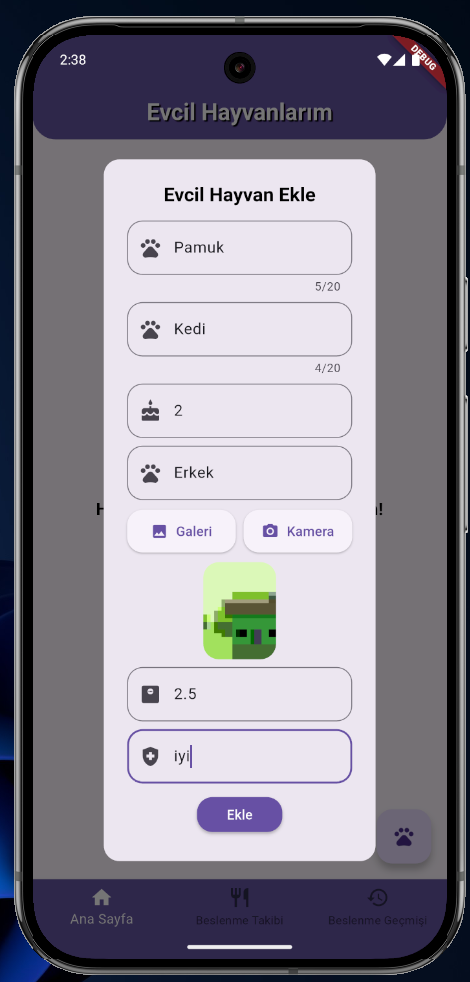

# Pet Tracking App

## Overview

The Pet Tracking App is a Flutter application designed to help pet owners manage and track their pets' feeding schedules, health status, and other important information. The app provides features such as adding pets, tracking feeding history, and setting reminders for feeding times.

## Technologies Used

### Flutter

- **Flutter SDK**: The core framework used to build the application. It provides a rich set of pre-designed widgets and tools for building natively compiled applications for mobile, web, and desktop from a single codebase.
- **Dart**: The programming language used to write the Flutter application.

### State Management

- **Provider**: A state management solution used to manage the state of the application. It allows for efficient and scalable state management by providing a way to share state across the widget tree.

### Database

- **Sqflite**: A plugin for SQLite, a self-contained, high-reliability, embedded, SQL database engine. It is used to store and manage the pet data locally on the device.

### Image Handling

- **Image Picker**: A plugin used to pick images from the device's gallery or camera. It allows users to add photos of their pets.

### UI Components

- **Smooth Page Indicator**: A package used to create smooth and customizable page indicators for the onboarding screens.

### Notifications

- **Flutter Local Notifications**: A plugin used to show notifications to the user. It is used to remind users about feeding times and other important events.

### Other Packages

- **Path**: A package used to manipulate file paths.

## Project Structure

The project is structured as follows:

```
lib/
├── main.dart
├── models/
│   ├── task.dart
│   └── feeding_record.dart
├── screens/
│   ├── home_screen.dart
│   ├── feeding_tracker_screen.dart
│   ├── feeding_history_screen.dart
│   └── onboarding_screen.dart
├── services/
│   ├── database_service.dart
│   └── notif_services.dart
└── widgets/
    └── custom_widgets.dart
```

## How to Run the Project

1. **Clone the repository**:
   ```sh
   git clone https://github.com/your-username/pet_tracking_app.git
   cd pet_tracking_app
   ```

2. **Install dependencies**:
   ```sh
   flutter pub get
   ```

3. **Run the application**:
   ```sh
   flutter run
   ```

## Features

- **Add Pets**: Users can add their pets by providing details such as name, type, age, breed, weight, health status, and a photo.
- **Feeding Tracker**: Users can track their pets' feeding schedules, including the type of food, meal time, amount, and whether the pet drank water.
- **Feeding History**: Users can view the feeding history of their pets.
- **Notifications**: Users receive notifications for feeding times and other important events.(Notification is not fully integrated)

## Screenshots and Video

### Video
<iframe width="560" height="315" src="https://www.youtube.com/watch?v=bCFSvZeF-w8" frameborder="0" allow="autoplay; encrypted-media" allowfullscreen></iframe>


### Onboarding Screen


### Home Screen





### Feeding Tracker Screen


### Feeding History Screen


## License

All rights of the project, its codes, code snippets, and assets belong to the owner of the github repository.
